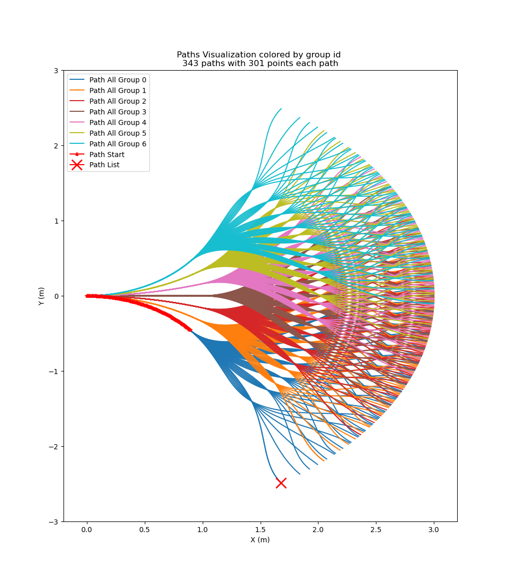

# Local motion planner using motion primitives and grid search

## Obstacle avoidance
1. Pre-generate a fix set of paths starting from the base of the robot using a spline function with different parameters.

2. 